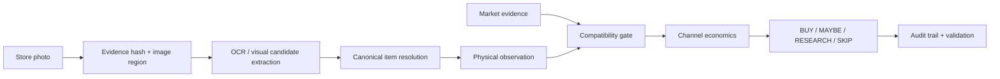
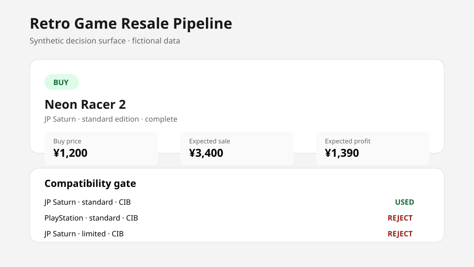

<div align="center">


# Retro Game Vision & Resale Pipeline

**Evidence-driven computer vision and data engineering for traceable resale decisions.**

[](https://github.com/marcelosofficial-ctrl/Retro-Game-Vision-Pipeline/actions/workflows/ci.yml)


[Portfolio case study](https://marcelosofficial-ctrl.github.io/portfolio/projects/reseller-ai/) · [Architecture](docs/architecture.md) · [Field validation](docs/field-validation.md)

</div>

A production-minded data pipeline for turning second-hand store photos into **traceable resale decisions**.

I started this project after noticing a real pricing gap in Japanese retro-game shops. Finding a cheap title is easy. Deciding whether one exact physical copy is actually worth buying is much harder: platform, region, edition, completeness, condition, evidence freshness, marketplace fees and exit channel can all change the answer.

The project grew from a small photo-reading experiment into a field-tested system with a normalized SQLite data model, image-evidence lineage, duplicate detection, compatibility guards, deterministic economics, checkpoint validation and an in-store decision workflow.

> This public repository is a portfolio-safe implementation of the core engineering ideas. Real store photos, marketplace datasets, source adapters and production scoring policy remain private.

## What I built



The system deliberately separates four things that price-scraping projects often collapse together:

- **Canonical item**: the product identity shared by multiple copies and market observations.
- **Physical observation**: one exact copy seen at one store, at one price, on one visit.
- **Market observation**: one sold listing, active ask, retail ask, buyback quote or guide observation.
- **Evidence asset**: the image or source document that supports a claim.

That separation is what makes it possible to answer not just **"what is this title worth?"** but **"is this exact copy worth buying at this exact price, and why?"**

## Engineering skills demonstrated

| Area | Work in this project |
| --- | --- |
| **Python** | Typed domain models, modular decision logic, CLI/demo workflows, hashing, validation utilities and testable business rules |
| **SQLite / data modeling** | Normalized entities, foreign keys, append-only evidence, idempotent writes, integrity checks and migration-safe checkpoints |
| **Computer vision workflow** | Image preservation, crop/grid derivation, OCR candidate extraction, spatial association and evidence-region tracking |
| **Data engineering** | Deduplication, canonical resolution, provenance, evidence typing, compatibility filtering and freshness handling |
| **Decision systems** | Deterministic fee/profit/ROI modeling, confidence gates, max-buy thresholds and explicit failure states |
| **Testing** | Regression tests for cross-platform, edition and completeness errors; idempotence and integrity checks |
| **DevOps** | GitHub Actions CI, publication-safety checks and reproducible package validation |
| **Product design** | Mobile-friendly in-store workflow, price what-if analysis and operational decision surfaces |

## Field-tested, not just a toy dataset

The private system currently operates at real field-test scale:

- **750+ canonical items**
- **1,000+ physical store observations**
- **1,800+ structured market observations**
- multiple validated live sourcing visits

One recent batch is a useful example of the pipeline working under messy real conditions:

- 10 uploaded photos were reduced to **9 unique evidence assets** after byte-level duplicate detection;
- the images contained **49 distinct physical copies**;
- **48 prices were directly readable** and one obscured price was intentionally left unknown instead of guessed;
- **47 new canonical titles** were added while 2 exact existing identities were reused;
- a targeted market refresh added **55 compatible market observations** rather than researching every title indiscriminately;
- the resulting screen produced **1 BUY, 7 MAYBE and 41 RESEARCH** decisions;
- all writes passed foreign-key and SQLite integrity checks, and repeat imports were verified as no-ops.

The interesting part is not the labels themselves. It is that the pipeline can refuse unsupported decisions, preserve uncertainty and explain exactly which evidence influenced each result.

## Problems the project had to solve

### 1. Whole-shelf photos produced bad title/price associations

Early experiments showed that reading a shelf as one image could attach a nearby price label to the wrong title. I changed the workflow so original images remain immutable evidence while derived crops/grids are analysis layers with explicit spatial lineage.

### 2. Same title does not mean same market value

A disc-only copy cannot silently borrow a complete-copy price. A budget reissue cannot borrow a standard-edition comp. A Saturn listing cannot price a PlayStation copy. Compatibility became a first-class gate rather than a cleanup step after valuation.

### 3. Marketplace evidence has different meanings

A sold listing, active listing, dealer buyback and retail asking price are not interchangeable. The model stores them as different evidence types so a high retail sticker cannot accidentally become expected seller proceeds.

### 4. Missing data must stay missing

If a price is covered by a finger, the system stores `NULL`. If a case is closed, the disc is not assumed present. If a sold date cannot be established, research time is not substituted for transaction time. These rules prevent confident-looking garbage from entering the decision layer.

### 5. Condition can completely reverse a decision

A title that looks attractive at headline market value can become a poor purchase once disc scratches, manual damage, missing inserts or cracked packaging are applied. Physical-copy state therefore remains separate from canonical title value.

## Public demo

The repository contains a synthetic end-to-end slice of the architecture. It uses fictional titles and deliberately simplified economics.

```bash
python -m pip install -e .
python -m retro_resale_pipeline.demo
python -m unittest discover -s tests -v
python scripts/prepublish_check.py
```

Example:

```text
BUY  Neon Racer 2 (JP Saturn)
Buy price:        ¥1,200
Expected sale:    ¥3,400
Expected profit:  ¥1,390
ROI:              115.8%
Evidence:         3 compatible sold observations
Database:         integrity=ok, foreign_keys=0
```



[Open the synthetic HTML dashboard](examples/synthetic_demo/dashboard.html)

## Repository map

```text
src/retro_resale_pipeline/
  domain.py          typed domain records
  evidence.py        SHA-256 evidence identity and region keys
  repository.py      small SQLite persistence + validation layer
  compatibility.py   platform / region / edition / completeness gates
  decision.py        simplified deterministic economics
  demo.py            synthetic end-to-end run

tests/
  compatibility, decision, evidence and idempotence regression tests

docs/
  architecture, data model, vision pipeline, field validation and ADRs

scripts/prepublish_check.py
  guards the public/private boundary in CI
```

## Reliability approach

Production work is done in small checkpoints. A write phase is not considered complete until the relevant checks pass:

1. create a protected backup;
2. apply the smallest schema/data change possible;
3. re-run the operation to confirm idempotence;
4. run `PRAGMA foreign_key_check`;
5. run SQLite `integrity_check`;
6. compare protected historical rows when required;
7. package the checkpoint;
8. extract it into a fresh directory and validate again.

This workflow caught real implementation mistakes before they reached an authoritative checkpoint, including linkage-order bugs and unsafe cross-comp assumptions.

## Documentation

- [Architecture](docs/architecture.md)
- [Data model](docs/data-model.md)
- [Vision and evidence pipeline](docs/vision-pipeline.md)
- [Engineering highlights](docs/engineering-highlights.md)
- [Anonymized field validation](docs/field-validation.md)
- [Provenance and failure modes](docs/provenance.md)
- [Public/private boundary](docs/public-private-boundary.md)
- [Architecture decision records](docs/adr/)

## Portfolio boundary

The public code is intentionally enough to inspect, run and test the architecture without distributing the production sourcing system. Real store photographs, marketplace source adapters, private market datasets, operational thresholds and the production database are not included.

## License

Published for portfolio and evaluation purposes. See [LICENSE](LICENSE).
