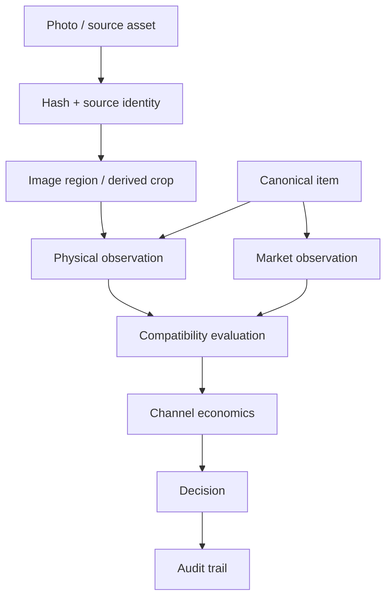

# Architecture

The system is built around a distinction that is easy to lose in a scraping project: **identity, physical sightings, market evidence and decisions are not the same record**.

## Layer boundaries

### Evidence layer

Preserves source identity. Derived crops do not replace originals. Duplicate assets can be detected by content hash.

### Identity layer

Resolves observed text/visual candidates to a canonical product while keeping physical copies separate.

### Market layer

Stores evidence with its type, platform, edition, completeness, date/freshness and source context.

### Compatibility layer

Rejects evidence that cannot safely price the physical copy. This gate runs before economics.

### Decision layer

Computes simplified channel proceeds, profit and ROI only after evidence passes compatibility rules. Unsupported cases remain explicit research states.

### Validation layer

Production writes are protected by backups, idempotence checks, foreign-key checks, integrity checks and checkpoint validation.
